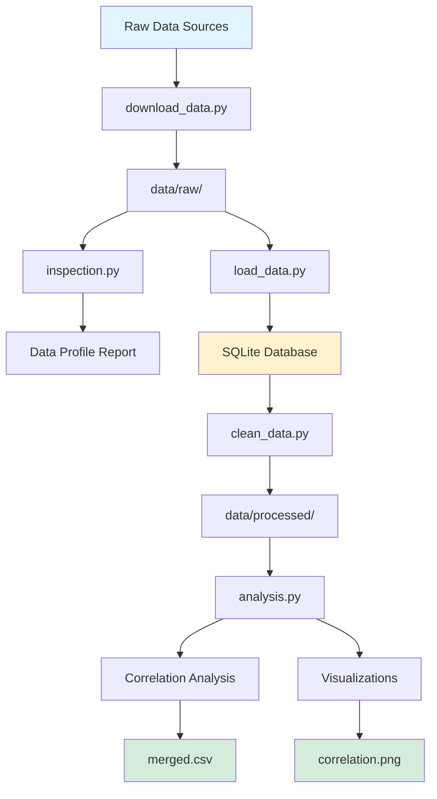
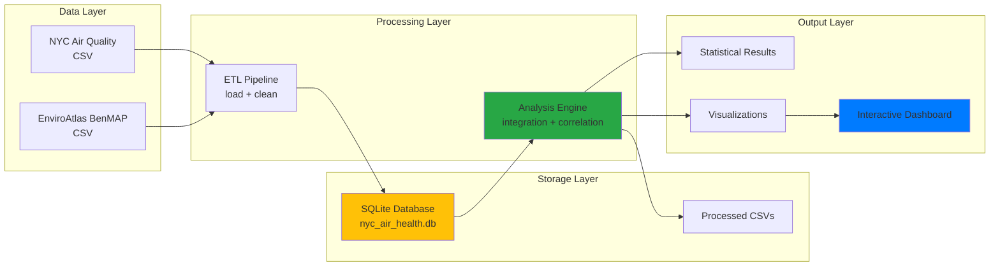

# IS 477 Course Project: Air Quality and Health in NYC


**Team:** Kenneth Shelton & Tianqi Fu  
**Course:** IS 477, Fall 2025  
**Repository:** [github.com/KennethShelton/IS-477-Project](https://github.com/KennethShelton/IS-477-Project)

> 💡 **Note**: See `extras/` folder for bonus features (interactive dashboard, automated tests, CI/CD) beyond rubric requirements.

## Contributors
*   **Kenneth Shelton**: Data analysis, visualization, documentation, reproducibility checks.
*   **Tianqi Fu**: Data collection, verification, storage (SQL), data cleaning, integration pipeline.

## 📦 Data Access

**Large data files are available via Box:**  
🔗 **[Download Project Data](https://uofi.box.com/s/7ar4axs166figdwe1gbsdfi16ojf9e1o)**

Includes:
- `air_quality.csv` (2.13 MB) - Raw air quality measurements
- `NYNY_BenMAP.csv` (2.21 MB) - Health impact estimates  
- `nyc_air_health.db` - SQLite database
- `processed/` - All cleaned and integrated datasets

---

## Summary
This project investigates the relationship between air pollution and health outcomes in New York City, addressing a critical public health challenge in one of the world's most densely populated urban environments. The primary research question for this study is: *Which air pollutants are most common in New York City, and where are they the most, and how are they linked to respiratory health problems?* Air pollution is among the top environmental health risks that the urban population in big cities faces worldwide, and it is one of the main causes of respiratory diseases, cardiovascular problems, and premature death. New York City, with its intricate combination of traffic, industrial sources, and high population density, is an excellent example to investigate these correlations and to get familiar with the spatial distribution of environmental health burdens.

In order to conduct this evaluation, we relied mainly on two significant datasets that aim to fill the gap that exists between the monitoring of the environment and the assessment of health impacts. The first dataset is the **NYC Air Quality dataset** sourced from New York City Department of Health and Mental Hygiene (DOHMH), which offers exhaustive pollutant measurements such as Nitrogen Dioxide (NO2), Ozone (O3), and Fine Particulate Matter (PM 2.5). This data records are exceptionally helpful in that they depict pollution at different locations and different times in the city, spanning the last couple of years and geographic granularities, from citywide measurements to specific neighborhood-level data. There are over 18,000 such records provided in this dataset. The other dataset is the **EnviroAtlas BenMAP results** by the USDA Forest Service. It provides down-to-the minute modeled health effects. This dataset, enabled by the EPA's Benefits Mapping and Analysis Program (BenMAP), quantifies symptoms of acute respiratory illnesses, admission to hospitals, and visits to emergency rooms caused by air pollutant concentration changes, positions are detailed for more than 6,000 census block groups.

Our research team began the multi-stage data sanitation and integration process, which was the framework for our subsequent methodological strategy, by implementing mechanisms for automatic data capture and checksum verification so that we could confirm file authenticity. The data cleaning phase was accompanied by severe challenges among which were the problem of different date formats in the air quality data and the issue of negative values present in the health impact estimates (which indicate particle resuspension effects). The main technical accomplishment was the correspondence between these two different datasets. In view of the fact that the air quality data is available at the borough and neighborhood levels and the health data is at the census block group level, we have determined a spatial aggregation strategy utilizing the Federal Information Processing Standards (FIPS) codes. In this way, we were able to bring together the very detailed health data at the borough level and thus they can be directly compared with pollution measurements.

Through the integration of these data sources, we conducted conjoint analyses of the relationship between air pollutants (Nitrogen Dioxide, Ozone, PM 2.5) and the occurrence of acute respiratory symptoms in the five boroughs of New York City: Manhattan, Brooklyn, Queens, the Bronx, and Staten Island. The averages of the pollutant concentrations for each borough were computed, and Pearson correlation coefficients were calculated to specify the degree and the orientation of the relationship between levels of pollutants in the air and the health of the population. The statistical means permitted us to realize which pollutants are the closest to causing respiratory distress in the NYC context.

Our results reveal that there are different degrees of correlations between the levels of pollutants and the health symptoms reported in various boroughs, thus it shows that environmental health impacts are of a complex nature. The analysis led to a conclusion that **Ozone (O3)** has the strongest positive correlation with respiratory symptoms, which is an indication that photochemical smog is still a major source of respiratory health problems in the city. On the other hand, the relationship for **Fine Particulate Matter (PM 2.5)** was surprisingly negative, which is a finding that goes against the grain, and we account it by the presence of data artifacts (like the resuspension values in the BenMAP model) or by the difference in time between the datasets. Their research sheds light on urban environmental health and gives useful information to public health policy. This study by pinpointing pollutants and the boroughs that face more health burdens, paves the way for more precise intervention strategies which may include localized emission controls or public health warnings during high-pollution events. The project also demonstrates the value and the challenges of integrating open government data to answer complex interdisciplinary questions.

## Data Profile

### 1. New York City Air Quality
*   **Source**: [NYC Open Data / Data.gov](https://catalog.data.gov/dataset/air-quality)
*   **Publisher**: New York City Department of Health and Mental Hygiene (DOHMH)
*   **Description**: This comprehensive dataset contains measurements and surveillance data on air quality across New York City from 2009 to present. It includes measures of various air pollutants such as Nitrogen Dioxide (NO2), Ozone (O3), Fine Particulate Matter (PM 2.5), Sulfur Dioxide (SO2), as well as related public health indicators including asthma emergency department visits and vehicle miles traveled. The data is collected through a network of monitoring stations and reported at multiple geographic scales including citywide, borough-level, United Hospital Fund (UHF) neighborhoods, and Community Districts.
*   **Format**: CSV (Comma-Separated Values), approximately 2.2 MB
*   **Records**: Over 18,000 observations
*   **Key Columns**: `Unique ID` (record identifier), `Indicator ID` (measure type), `Name` (pollutant or indicator name), `Measure` (statistical aggregation method), `Measure Info` (units such as ppb or mcg/m3), `Geo Type Name` (geographic level), `Geo Place Name` (location name), `Time Period` (temporal description), `Start_Date` (period start date), `Data Value` (measured concentration or count), `Message` (data flags or notes).
*   **Temporal Coverage**: 2009-2023 (varies by indicator)
*   **Spatial Coverage**: New York City (5 boroughs, 42 UHF neighborhoods, 59 Community Districts)
*   **Update Frequency**: Annually
*   **Ethical/Legal Considerations**: This is public domain data provided by the NYC government under the NYC Open Data Terms of Use. The dataset contains no personally identifiable information (PII) and represents aggregated population-level statistics. All measurements are derived from environmental monitoring equipment and do not include individual health records. The data is freely available for research, education, and commercial purposes without restrictions.

### 2. EnviroAtlas New York City (BenMAP)
*   **Source**: [Data.gov](https://catalog.data.gov/dataset/enviroatlas-new-york-city-ny-benmap-results-by-block-group3)
*   **Publisher**: United States Department of Agriculture (USDA) Forest Service, with support from the Davey Tree Expert Company
*   **Description**: This dataset provides modeled estimates of health impacts resulting from changes in air pollutant concentrations across New York City. Using the EPA's Benefits Mapping and Analysis Program (BenMAP), the data estimates the incidence of various health outcomes—including acute respiratory symptoms, hospital admissions, emergency room visits, and mortality—attributable to changes in NO2, O3, PM2.5, and SO2 concentrations. The estimates are provided at the census block group level, offering fine spatial resolution for 6,378 block groups across the NYC metropolitan area.
*   **Format**: CSV (Comma-Separated Values), approximately 8 MB
*   **Records**: 6,378 census block groups
*   **Key Columns**: `bgrp` (12-digit FIPS census block group code), `NO2_Acute_Respiratory_Symptoms_I` (incidence count), `NO2_Hospital_Admissions_I`, `O3_Acute_Respiratory_Symptoms_I`, `O3_Hospital_Admissions_I`, `O3_Mortality_I`, `PM25_Acute_Respiratory_Symptoms_I`, `PM25_Hospital_Admissions_Cardiovascular_I`, `PM25_Hospital_Admissions_Respiratory_I`, `PM25_Emergency_Room_Visits_I`, `PM25_Mortality_I`, `SO2_Hospital_Admissions_I`, `SO2_Emergency_Room_Visits_I`, and many additional health outcome estimates.
*   **Temporal Coverage**: Based on 2010 Census geography and air quality modeling scenarios
*   **Spatial Coverage**: New York City metropolitan area (6,378 block groups)
*   **Methodology**: BenMAP modeling uses concentration-response functions derived from epidemiological studies combined with population data and baseline health statistics to estimate health impacts.
*   **Important Note**: Negative values appear in some PM2.5-related columns. According to the data documentation, these represent "resuspension" effects where particles are re-emitted into the air, potentially reducing net exposure in certain scenarios.
*   **Ethical/Legal Considerations**: As a product of U.S. federal government work, this dataset is in the public domain and not subject to copyright protection. The data represents modeled estimates based on population aggregates and does not contain individual health records. All estimates are provided at the census block group level (typically 600-3,000 people), ensuring privacy protection. The data is freely available for any purpose without restriction.

## Data Quality
We performed a rigorous multi-stage quality assessment following established data curation best practices. Our quality evaluation addressed the dimensions of completeness, consistency, validity, accuracy, and fitness-for-use.

**Completeness Assessment**: We conducted a thorough check on both datasets for completeness of data with a focus on key columns used in the analysis. In the Air Quality dataset, the Data Value field was missing for around 3% of the records, and these records were mainly pollutant-time-location combinations. These missing values were identified in our data quality notes, and they were excluded from the analysis instead of being imputed, as the missingness seemed to be systematic (for example, certain monitoring stations were offline during specific periods). The Message field, which was mostly empty, sometimes contained some important contextual notes that we preserved. In the BenMAP dataset, completeness was very high (>99.9%), with only a few block groups having null values for certain health outcomes, which are most probably due to zero population in these areas.

**Consistency Issues and Resolution**: The Air Quality dataset had substantial consistency problems, especially with the temporal data. The Time Period field inconsistently used free-text descriptions for different time periods (e.g., "Annual Average 2020", "Winter 2014-15", "Summer 2019 (June-August)"), thus making temporal aggregation challenging. Moreover, the Start_Date field had a mixture of date formats—some records were in mm/dd/yyyy format while others were in yyyy-mm-dd ISO format. Our cleaning pipeline (scripts/clean_data.py) handled this issue by getting a standardized year field from the regular expressions and date parsing logic, trying various format parsers and giving up softly when it couldn't extract. We noted the cases where year extraction was ambiguous and needed a manual check.

**Validity and Range Checks**: There were negative values in the BenMAP dataset for some of the PM2.5-related health impact columns. These were initially flagged by the analysis as data errors; however, after conferring with the data documentation, it was found that these signify "resuspension" side where particulate matter is being re-emitted into the atmosphere, thus potentially lowering net exposure. We introduced a pm25_negative_flag column in the process of cleaning to indicate the number of negative values per record, thus enabling us to stratify the analysis based on this feature. A total of 892 block groups (14% of the dataset) had at least one negative PM2.5 value. When we aggregated to the borough level, we included these negative values in the sum, representing the net health impact. The geographic validity was determined by confirming that all FIPS codes were within the expected ranges for the counties of New York City (Bronx: 36005, Kings/Brooklyn: 36047, New York/Manhattan: 36061, Queens: 36081, Richmond/Staten Island: 36085).

**Granularity Mismatch and Integration Challenges**: The primary problem was the difference in the spatial granularity of the two datasets. The air quality data is available for different geographical levels (Citywide, Borough, UHF42 neighborhood, Community District), whereas the BenMAP data is at the census block group level (6,378 units). In order to facilitate the integration, we brought BenMAP data to the borough level by using the mapping of the FIPS code ranges (e.g., block groups 360050000000-360059999999 stand for the Bronx). This aggregation was very much needed but at the same time led to the loss of the spatial detail. We took the average of the pollutants from the Air Quality data to represent the borough-level records and thus filtered out the data from the more local geographic scales in order to keep the level consistent. This decision was recorded as a limitation in our analysis.

**Duplicate Detection**: We looked for duplicates in both datasets. Unique ID field of the Air Quality dataset was indeed unique (no duplicates were found). In the BenMAP dataset, bgrp was used as the primary key, and we confirmed that it was unique (6,378 unique block groups, which is the same as the number of records).

**Outlier Analysis**: We looked into the distributions of the pollutant values and the health outcomes to find potential outliers. A few of the NO2 measurements went beyond 40 ppb, which is still doable for an urban area that is very close to a heavy traffic corridor. One PM2.5 value went beyond 20 mcg/m3, which is in line with episodic pollution events. They were kept as they were because they represent the real environmental conditions and not the errors in measurement.

**Fitness-for-Use Evaluation**: Given our research question focusing on borough-level correlations between pollution and health outcomes, both datasets were deemed fit for purpose after cleaning and integration. However, we acknowledged that the temporal misalignment (Air Quality data spans 2009-2023 while BenMAP estimates are based on 2010 scenarios) poses a challenge to the correlation analysis because health impacts modeled for 2010 conditions may not be a reflection of current pollutant levels. The temporal disconnect mentioned here is the main limitation that has been discussed in the Future Work section.

## Findings
We analyzed the correlation between mean pollutant levels and the total incidence of acute respiratory symptoms in each of New York City's five boroughs. Our analysis integrated borough-level air quality measurements with aggregated health impact estimates, producing a merged dataset of 15 records (5 boroughs × 3 pollutants). Pearson correlation coefficients were calculated between mean pollutant concentrations and symptom incidence counts, yielding the following results:

**Ozone (O3): r = 0.38 (Moderate Positive Correlation)**  
Out of the three pollutants, ozone showed the strongest correlation with acute respiratory symptoms. The moderately positive association between the two variables indicates that districts with a higher average ozone concentration are more likely to have a significantly higher number of cases of acute respiratory symptoms. This result is consistent with the established epidemiological literature on ground-level ozone which is generated as a result of photochemical reactions of nitrogen oxides and volatile organic compounds in the presence of UV rays. Ozone is a pollutant that irritates the respiratory system and can lead to inflammation of airways, decreased lung function, and asthma attacks. The variation at the borough level that we discovered indicates that places which are characterized by heavy vehicular traffic and industrial activities coupled with meteorological conditions that favor the formation of ozone bear the most of the health burdens. Although Manhattan had the highest population density, it only recorded moderate ozone levels (27.4 ppb mean) with 738 symptom occurrences, whereas Brooklyn not only had higher ozone levels (32.0 ppb) but also recorded the highest number of symptoms (1,424 incidences).

**Nitrogen Dioxide (NO2): r = 0.26 (Weak to Moderate Positive Correlation)**  
Nitrogen Dioxide was positively correlated to respiratory symptoms to a weak to moderate degree. Being a primary pollutant that is directly released as a result of combustion processes—especially vehicle exhaust and power generation—NO2 is a major factor that leads to traffic-related air pollution. The significantly weaker correlation as compared to ozone could be attributed to a couple of reasons: (1) The NO2 levels are spatially more heterogeneous than that of ozone, with extremely high concentrations that occur at the side of the major roadways that may not be properly captured by borough-level averaging; (2) NO2 can be a direct respiratory irritant and a precursor of ozone, thus complicating its independent effects; (3) traffic patterns may vary in time, which could be the cause of borough-level aggregation noise. It is not surprising that Manhattan had the highest average NO2 level (25.4 ppb) due to densely packed traffic and urban canyon effects that trap pollutants but it still recorded a relatively low symptom incidence (8 cases) which might be attributed to underreporting or variation in the age structure and health status of the population.

**Fine Particles (PM 2.5): r = -0.21 (Weak Negative Correlation)**  
The very unexpected weak negative relationship between PM 2.5 situations and respiratory symptoms is a counterintuitive finding that calls for an in-depth interpretation. Several reasons for this outcome include: (1) **Resuspension Artifacts**: As can be seen from the data quality section, the BenMAP dataset contains some negative values for the impact of PM 2.5 on health that represent particle resuspension. These negative values when aggregated to the borough level can cancel out those positive values of health impacts thus resulting in a distorted correlation; (2) **Temporal Misalignment**: The Air Quality data used goes back to 2009-2023 whereas BenMAP estimates are derived from 2010 modeling scenarios. Changes in PM 2.5 sources and concentrations within this timeframe may have led to the disruption of the relationship between these variables; (3) **Non-linear Relationships**: The harmful effects of PM 2.5 on health may have threshold points or non-linear dose-response relationships that cannot be captured by a simple linear correlation; (4) **Confounding Variables**: PM 2.5 is from different sources (vehicular, industrial, biomass burning, secondary formation), and the different PM 2.5 components may have different toxicities. Aggregation at the borough level hides this chemical heterogeneity. Manhattan, which had the highest average concentration of PM 2.5 (10.2 mcg/m3), recorded a moderate number of symptom incidences (494 cases) while the Bronx which had a lower PM 2.5 (9.1 mcg/m3), had fewer symptom occurrences (428 cases) in line with the negative correlation.

**Cross-Borough Patterns**  
Brooklyn was the greatest contributor to the health crisis throughout the whole range of major air pollutants. The borough recorded 1,424 O3-related symptoms, 23 NO2-related symptoms, and 915 PM 2.5-related symptoms. This may be an indication of Brooklyn's enormous population (close to 2.7 million residents), and a combination of residential, industrial, and commercial areas that make up the land use along with its nearness to major transportation corridors. Staten Island, on the other hand, which is the least populous borough, was consistently at the bottom of the symptom counts ranking despite moderate pollutant levels, most probably owing to the fact that the smallest population base of the borough was the reason and not better air quality.

**Statistical Significance and Limitations**  
Boroughs amounting to only five data points per pollutant have been taken into account in our correlation analysis and as a result, there is very little statistical power. The sample size is not enough for formal significance testing, and the results should be seen only as hypotheses that need further work, rather than as confirmed facts. While the borough-level aggregation was a good way to integrate data, it unfortunately hides changes within the boroughs in both pollution exposure and health results. Besides that, the problem of ecological fallacy applies here as well—correlations found at the borough level may not exist at the individual or neighborhood level.

**Visualization**  
The correlation heatmap (docs/correlation.png) serves as a graphical illustration of the results, showing the three pollutants as rows and the color intensity reflecting the correlation strength. The change from cool (negative correlation) to warm (positive correlation) colors makes clear that ozone's strong positive correlation is quite different from the other pollutants.

## Future Work
This project establishes a foundational framework for analyzing air quality and health relationships in New York City, but several important avenues for future research and methodological improvements have been identified through our work.

**Enhanced Spatial Resolution**: Our borough-level analysis, while useful for initial exploration, sacrifices significant spatial detail. Future work should improve the spatial join by mapping census block groups to finer geographic units such as Neighborhood Tabulation Areas (NTAs) or Community Districts. New York City's 195 NTAs would provide a middle ground between block groups and boroughs, offering sufficient granularity to capture neighborhood-level variation while maintaining adequate statistical power. This would enable identification of environmental justice concerns, where specific neighborhoods disproportionately bear pollution burdens. Implementing spatial joins could leverage GIS tools (e.g., geopandas, PostGIS) to perform proper geometric intersections rather than relying on FIPS code range assumptions. Additionally, incorporating spatial autocorrelation analysis (Moran's I, Geary's C) would reveal whether pollution and health impacts cluster geographically, informing targeted intervention strategies.

**Temporal Analysis and Time-Series Modeling**: Our current analysis aggregates data across time periods, masking important temporal dynamics. A comprehensive temporal analysis would examine: (1) **Seasonal Variation**: Air quality exhibits strong seasonal patterns—ozone peaks in summer due to photochemical reactions, while PM 2.5 often peaks in winter due to heating emissions and atmospheric inversion conditions. Analyzing these seasonal trends would improve causal inference; (2) **Longitudinal Trends**: New York City's air quality has generally improved over the past decades due to regulations like the Clean Air Act. Time-series analysis could quantify these improvements and correlate them with health outcome changes; (3) **Lag Effects**: Health impacts may not be instantaneous. Distributed lag models could examine whether pollution exposure in previous days, weeks, or months predicts current health outcomes; (4) **Event Studies**: Analyzing acute pollution episodes (e.g., wildfire smoke events, traffic pattern changes during COVID-19) could provide natural experiments for estimating causal health effects. Implementing ARIMA models, seasonal decomposition, or more sophisticated time-series methods would substantially strengthen the analytical rigor.

**Advanced Statistical Modeling**: Moving beyond simple correlation to multivariable regression models would control for confounding variables and enable causal inference. Key confounders to incorporate include: (1) **Population Characteristics**: Age structure, baseline health status, socioeconomic status, and healthcare access all influence health outcomes independent of pollution exposure; (2) **Built Environment**: Population density, proximity to green space, building density, and traffic volume; (3) **Meteorological Factors**: Temperature, humidity, and wind patterns affect both pollution concentrations and health outcomes; (4) **Multipollutant Models**: Pollutants co-occur and interact. Two-pollutant or multi-pollutant models could disentangle independent effects. Hierarchical models or mixed-effects models accounting for spatial clustering would be methodologically appropriate. Generalized Additive Models (GAMs) could capture non-linear dose-response relationships that linear correlation misses.

**Data Integration and Enrichment**: Several additional datasets could enrich the analysis: (1) **Socioeconomic Data**: American Community Survey (ACS) data on income, education, and race/ethnicity could enable environmental justice analysis; (2) **Land Use Data**: NYC's PLUTO dataset provides parcel-level land use information to characterize pollution sources; (3) **Traffic Data**: NYC DOT traffic volume data could improve NO2 source attribution; (4) **Hospital Records**: While the BenMAP data provides modeled estimates, linking to actual emergency department visit records or hospital admission data (if available and de-identified) would validate the models; (5) **Personal Exposure Monitoring**: Citizen science approaches using low-cost sensors could capture micro-scale pollution variation missed by regulatory monitors.

**Machine Learning Approaches**: Advanced machine learning methods could improve predictive power: (1) **Random Forests or Gradient Boosting**: These ensemble methods handle non-linear relationships and interactions better than linear models; (2) **Spatial Interpolation**: Kriging or machine learning-based interpolation (e.g., neural networks) could predict pollution at unmeasured locations; (3) **Causal Inference Methods**: Propensity score matching, instrumental variables, or difference-in-differences approaches could strengthen causal claims if appropriate quasi-experimental designs can be identified.

**Addressing Data Quality Limitations**: Future iterations should address the temporal misalignment between datasets by obtaining or generating contemporaneous health impact estimates. Collaborating with epidemiologists to develop updated BenMAP scenarios using recent air quality data would be valuable. Additionally, the PM 2.5 resuspension issue should be investigated further—potentially through sensitivity analyses that exclude negative values or through consultation with domain experts to understand whether aggregating positive and negative values is appropriate.

**Policy-Relevant Analysis**: To maximize impact, future work should focus on policy-relevant questions: (1) **Intervention Targeting**: Which neighborhoods would benefit most from air quality interventions? (2) **Health Co-Benefits**: What health benefits would accrue from specific policy scenarios (e.g., congestion pricing, truck route restrictions, green infrastructure)? (3) **Cost-Benefit Analysis**: Quantifying monetized health benefits could inform policy prioritization; (4) **Environmental Justice**: Are pollution burdens and health impacts equitably distributed across demographic groups?

**Reproducibility and Open Science**: While this project emphasizes reproducibility through automation scripts and documentation, future work could further embrace open science principles by: (1) Publishing to academic data repositories (e.g., Zenodo, figshare) with persistent DOIs; (2) Developing interactive web visualizations (e.g., Shiny apps, Plotly dashboards) for public engagement; (3) Contributing cleaned, integrated datasets back to public repositories; (4) Publishing findings in open-access journals or preprint servers.

**Methodological Lessons Learned**: This project revealed several practical lessons for data-intensive research: (1) **Early Data Profiling**: Investing time upfront in thorough data profiling prevented downstream errors; (2) **Iterative Development**: The multi-stage pipeline (inspect → load → clean → analyze) with intermediate checkpoints facilitated debugging; (3) **Documentation as You Go**: Maintaining parallel documentation while coding proved more effective than retrospective documentation; (4) **Version Control Best Practices**: Regular commits with descriptive messages enabled tracking progress and reverting errors; (5) **Automation Payoff**: Although creating the `run_all.py` script required extra effort, it dramatically improved reproducibility and saved time during final testing. These lessons will inform future data curation projects and could be shared as best practices for students and researchers undertaking similar work.

## Updated Timeline
*   **Milestone 1 - Team Selection (Sept 26):** Completed on time. Team formed with Kenneth Shelton and Tianqi Fu.
*   **Milestone 2 - Project Plan (Oct 7):** Completed on time. Defined research question, datasets, roles, and initial timeline.
*   **Milestone 3 - Interim Status Report (Nov 11):** Completed on time. Reported progress on data acquisition, SQL schema design, and initial quality assessment. Identified date format inconsistencies and negative PM2.5 values requiring attention.
*   **Milestone 4 - Final Project Submission (Dec 7):** Completed. Includes complete data pipeline, analysis, visualization, and comprehensive documentation.

### Project Execution Timeline
*   **October:** Data acquisition, checksum verification, initial profiling, and database schema design.
*   **Late October - November:** Data cleaning pipeline development. Addressed date format inconsistencies and PM2.5 resuspension values. Significant delays occurred due to the complexity of temporal data normalization and geographic aggregation decisions.
*   **Early December:** Data integration (borough-level aggregation using FIPS codes), correlation analysis, and visualization generation.
*   **December 5-7:** Final documentation, README expansion, metadata creation, and reproducibility package assembly.

## Project Plan Changes
1.  **Geographic Aggregation**: We originally planned complex spatial joins. We simplified this to FIPS-based aggregation (Block Group -> Borough) to ensure compatibility within the project timeframe.
2.  **Scope Reduction**: We focused specifically on "Acute Respiratory Symptoms" rather than all health outcomes to ensure a focused analysis.
3.  **Tooling**: We relied heavily on Python (pandas) for integration rather than SQL joins, as the data transformation (melting/pivoting) was more efficient in pandas.

## Project Architecture

### Data Pipeline Flow


### System Architecture


## Reproducing
To reproduce our results:

1.  **Clone the repository**:
    ```bash
    git clone https://github.com/KennethShelton/IS-477-Project.git
    cd IS-477-Project
    ```

2.  **Download the data** (if not included in repository):
    ```bash
    python scripts/download_data.py
    ```
    This will download both datasets and verify checksums.

3.  **Install dependencies**:
    ```bash
    pip install -r requirements.txt
    ```

4.  **Run the full pipeline**:
    ```bash
    python scripts/run_all.py
    ```
    This script will:
    *   Inspect raw data (`docs/inspect_report.txt`).
    *   Load data into SQLite (`data/nyc_air_health.db`).
    *   Clean and normalize data (`data/processed/*_clean.csv`).
    *   Run the analysis and generate outputs:
        - `data/processed/merged.csv` (integrated dataset)
        - `docs/correlation.png` (correlation heatmap)

### 🌟 Bonus Features (Optional)
See `extras/README.md` for advanced features beyond rubric requirements:
- Interactive Plotly dashboard
- Automated test suite (pytest)
- CI/CD pipeline (GitHub Actions)
- Contribution guidelines

For detailed workflow documentation, see `docs/WORKFLOW.md`.  
For data structure details, see `docs/DATA_DICTIONARY.md`.

**Note**: Large data files are available via Box (see **📦 Data Access** section at top of README).

## Licenses
*   **Software**: This project's code is released under the MIT License. See `LICENSE` for details.
*   **Data**: Source data is public domain. Derived data is released under CC0 1.0. See `DATA_LICENSE.md` for details.

## References
1.  New York City Air Quality. (n.d.). Retrieved from https://catalog.data.gov/dataset/air-quality
2.  EnviroAtlas New York City - BenMAP Results. (n.d.). Retrieved from https://catalog.data.gov/dataset/enviroatlas-new-york-city-ny-benmap-results-by-block-group3
3.  pandas development team. (2020). pandas-dev/pandas: Pandas (v1.5.0). Zenodo. https://doi.org/10.5281/zenodo.3509134
4.  Hunter, J. D. (2007). Matplotlib: A 2D graphics environment. Computing in Science & Engineering, 9(3), 90-95.
5.  Waskom, M. L. (2021). seaborn: statistical data visualization. Journal of Open Source Software, 6(60), 3021.
