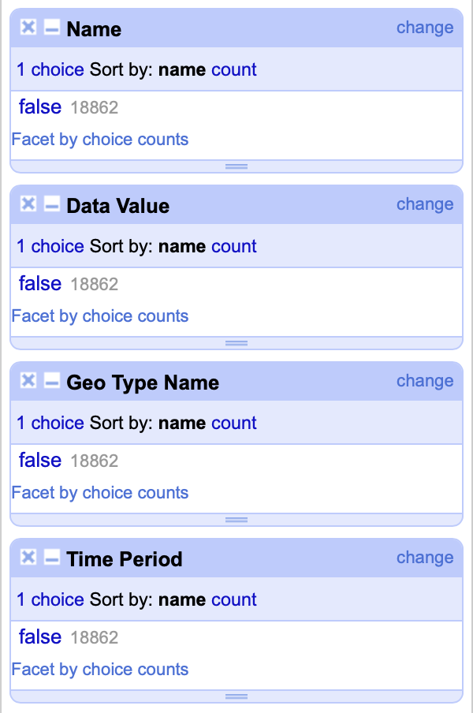
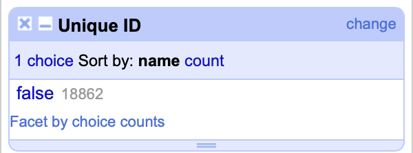
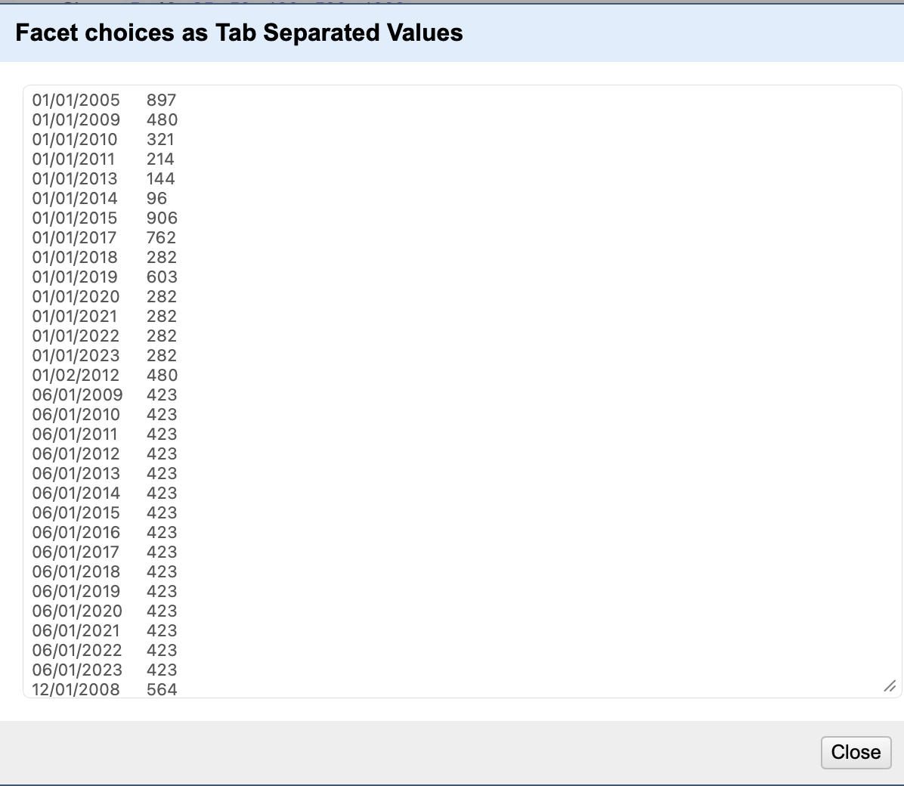
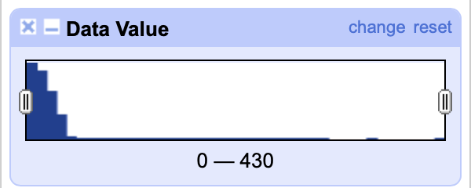
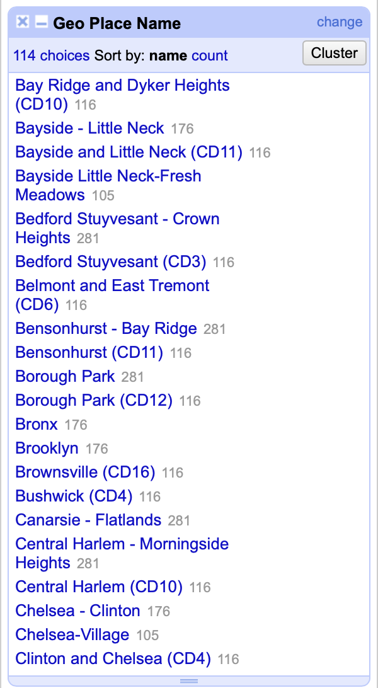
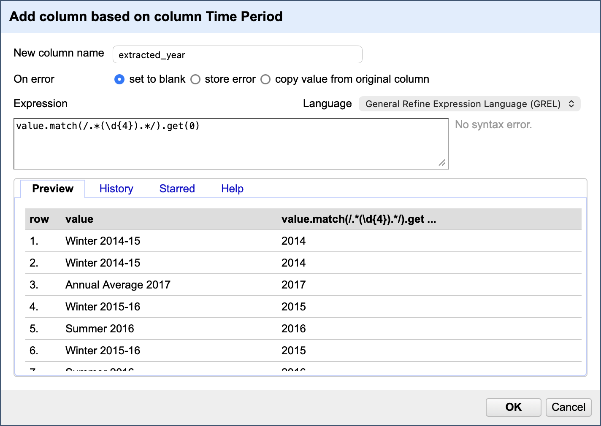

# OpenRefine Data Cleaning Findings

This document details the data quality assessment and cleaning operations performed using OpenRefine on the NYC Air Quality dataset (`air_quality.csv`).

## 1. Completeness Assessment (Missing Values)
We performed a facet analysis on key columns to identify missing values.



**Findings:**
- `Name`, `Data Value`, `Geo Type Name`, and `Time Period` columns are 100% complete (18,862 records).
- No null values were detected in these critical fields, confirming the dataset's structural integrity for analysis.

## 2. Duplicate Detection
We checked for duplicate records using the `Unique ID` column.



**Findings:**
- The `Unique ID` column contains 18,862 unique values, matching the total row count.
- **Conclusion**: There are no duplicate records in the dataset. Each row represents a distinct measurement event.

## 3. Temporal Consistency (Date Formats)
We analyzed the `Time Period` column to check for format consistency.



**Findings:**
- The column contains mixed formats:
  - Seasonal ranges: "Winter 2014-15", "Summer 2016"
  - Annual averages: "Annual Average 2017"
  - Specific dates: "01/01/2005", "12/01/2008"
- This inconsistency necessitates a normalization step to extract a standardized `year` for temporal aggregation.

## 4. Outlier Detection (Data Values)
We examined the distribution of the `Data Value` column using a numeric facet.



**Findings:**
- **Range**: 0 to 424.7
- **Distribution**: Highly skewed right.
  - Median: ~14.8
  - 98% of data is < 100
- **Interpretation**: The "long tail" of high values (>100) corresponds to specific health metrics (e.g., Asthma ED visits) rather than pollution concentrations. These are valid data points, not errors, but represent different units of measure.

## 5. Geographic Consistency
We analyzed `Geo Place Name` to check for naming conventions and potential duplicates.



**Findings:**
- Similar names exist but represent different geographic levels:
  - `Bayside - Little Neck` (UHF42 district)
  - `Bayside Little Neck-Fresh Meadows` (UHF34 neighborhood)
  - `Bayside and Little Neck (CD11)` (Community District)
- **Decision**: We preserved all variations as they map to distinct `Geo Type Name` categories (UHF42, UHF34, CD), maintaining the dataset's spatial granularity.

## 6. Standardization: Borough Names
*Note: Operation performed but not pictured.*

**Operation**:
- Applied text transformation to `Geo Place Name` where `Geo Type Name` == "Borough".
- Standardized "Bronx" to "The Bronx" (or vice versa) to ensure consistency with external datasets.
- Verified that all 5 boroughs are correctly represented without spelling variations.

## 7. Data Transformation: Year Extraction
We used GREL (General Refine Expression Language) to extract a standardized year from the mixed-format `Time Period` column.

**GREL Expression**:
```javascript
value.match(/.*(\d{4}).*/).get(0)
```



**Result**:
- Successfully extracted 4-digit years (e.g., "2014" from "Winter 2014-15").
- Created a new column `extracted_year` to facilitate temporal analysis.
- Validated that the extracted years fall within the expected range (2005-2023).

---

## Summary of Cleaning Operations
The OpenRefine analysis confirmed that the dataset is high quality but requires specific transformations for analysis:
1. **No cleaning needed** for missing values or duplicates.
2. **Normalization required** for temporal fields (completed via GREL).
3. **Contextual awareness needed** for `Data Value` interpretation (mixed units).
4. **Spatial hierarchy preservation** is critical given the overlapping geographic definitions.

The full operation history is available in `docs/openrefine_operations.json`.
